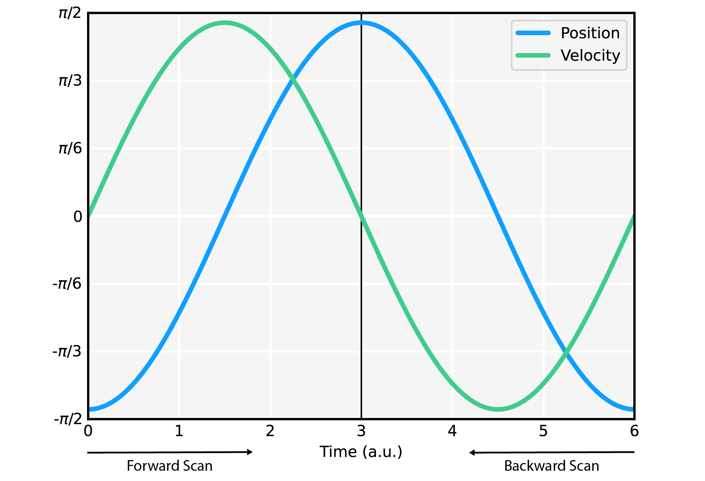

Image Processing
================

Resonant Deinterlacing
**********************
Resonance scanning microscopes achieve fast image acquisition by pairing a slow-galvometric mirror with a fast-resonance
scanning mirror: the fast-resonant scanning mirror rapidly scans a single-axis of the field-of-view
(i.e., a horizontal line), while the slow-galvometric mirror moves the line along a second-axis.
Further gains in acquisition speed are achieved by acquiring images during both the forward and backward scans of the
resonant mirror. That is, lines are scanned in alternating directions instead of returning to the origin after each
scan in a left-right, left-right, left-right strategy.

While galvometric scanning mirrors can be tightly-controlled using servos, resonant scanning mirrors lack such granular
control. Resonance scanning mirrors achieve their rapid motion by *vibrating* at a fixed frequency. Resonance scanning
mirrors are extremely under-dampened harmonic oscillators: while their frequency is tightly distributed, they are prone
to large variations in amplitude given very small deviations in their drive. Resonance scanning mirrors also display a
smooth cosinusoidal velocity through their entire range-of-motion--the scanner moves slower near the limits of its
range--that further complicates synchronization to an external frequency or other means of fine control. Therefore,
the entire microscope is typically aligned to the motion of the resonance scanner.

Resonance-scanning microscopes generate pixel-streams that most microscopy software organize by resonance-scanning
cycles. Rather than immediately organizing pixels into individual lines, pixels are collected through the complete
oscillation of the resonant scanner. The data is then split down the center and the latter half reversed to generate
two lines. Because the exact angle of the mirror at any given time is variable, the exact index of the center pixel is
usually defined manually within the software or estimated in real-time by a software algorithm. Never-the-less,
variations related to temperature, drive fluctuations, and murphy's law--as well as poor signal-to-noise--often result
in images with interlacing artifacts. CalSciPy provides a convenient
:class:`deinterlace <CalSciPy.images.deinterlacing.deinterlace>`  function to correct for these artifacts.

.. centered:: Deinterlacing images

.. code-block:: python

   from CalSciPy.images import deinterlace
   import numpy as np

    # standard case
   images = deinterlace(images)

   # correcting noisy data with external reference
   y_pixels, x_pixels = images.shape[1:]
   reference = np.std(images, axis=0).reshape(1, y_pixels, x_pixels)  # get z-projected standard deviation
   images = deinterlace(images, reference=reference)

Unfortunately, the fast-fourier transform methods that underlie the implementation of the deinterlacing algorithm
have poor spatial complexity (i.e., large memory constraints). This weakness is particularly problematic when using
GPU-parallelization. To mitigate these issues, deinterlacing can be performed in-place and batch-wise while
maintaining  numerically identical results.

.. centered:: Deinterlacing images (memory constrained)

.. code-block:: python

    from CalSCiPy.images import deinterlace

    # In-Place
    deinterlace(images, in_place=True)

    # Batch-wise
    images = deinterlace(images, batch_size=5000)

Multi-dimensional Filtering
***************************
CalSciPy supports fast de-noising of imaging stacks using multidimensional filters.

.. centered:: Filtering imaging stacks

.. code-block:: python

   from CalSciPy.images import gaussian_filter

   # standard deviation of gaussian kernel
   sigma = 1.0

   filtered_images = gaussian_filter(images, sigma=sigma)

In some situations you may be under memory-constraints. CalScipy supports both in-place and blockwise filtering in these
scenarios: simply utilize the in_place or block_size keywords.

.. centered:: Memory-constrained filtering

.. code-block:: python

   from CalSciPy.images import median_filter

   # size of median filter
   window = (3, 3, 3)

   # 7000 frame blocks
   filtered_images = median_filter(images, window=window, block_size=7000)

   # 7000 frame blocks with 3500 frame overlap
   filtered_images = median_filter(images, window=window, block_size=7000, block_buffer=3500)

   # in-place calculation
   filtered_images = median_filter(images, window=window, in_place=True)

Available Multi-dimensional Filters
***********************************
* :func:`Gaussian Filter <CalSciPy.images.gaussian_filter>`
* :func:`Median Filter <CalSciPy.images.median_filter>`

.. note::

   Using gpu-parallelization is recommended to quickly process imaging stacks. Being said, using gpu parallelization
   requires that the dataset fit within your GPU's VRAM. In most cases, this requires breaking the dataset down into
   smaller blocks. This can be done automatically by using the block_size keyword.
